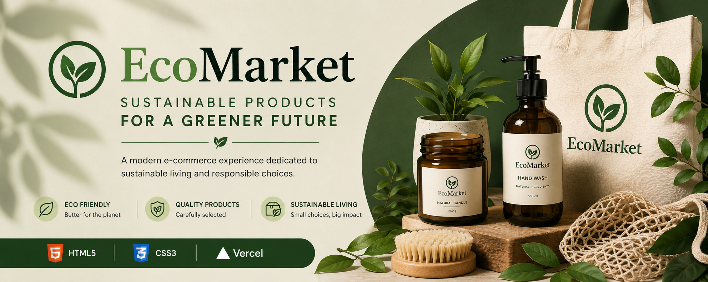
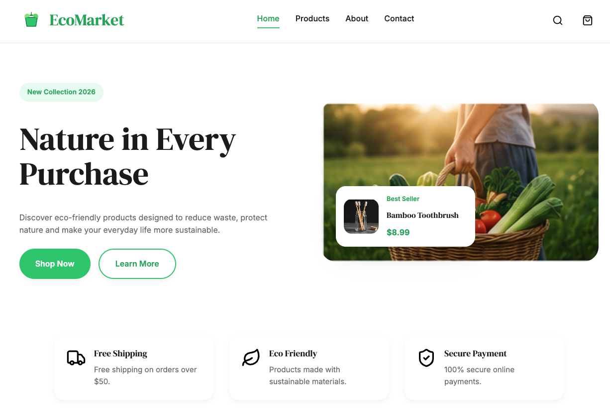
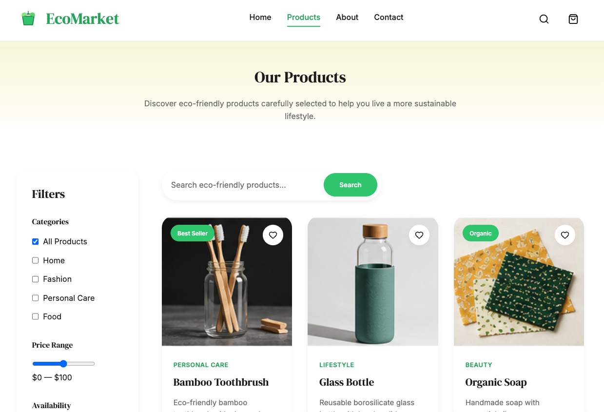
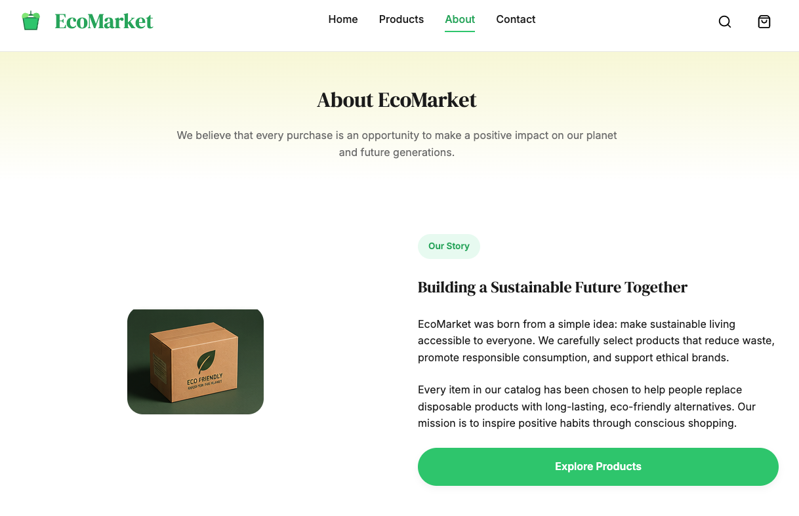
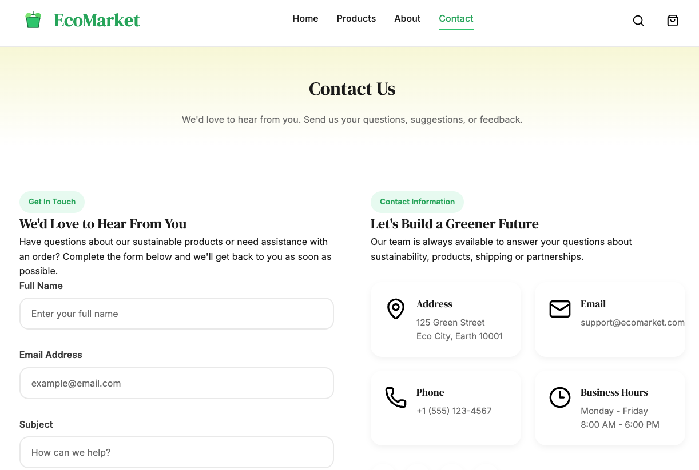

# 🌿 EcoMarket

<p align="center">



</p>

<div align="center">

# Sustainable Products for a Greener Future

A responsive e-commerce website focused on sustainable and eco-friendly products.

Developed using **HTML5**, **CSS3**, **Flexbox**, **CSS Grid** and **BEM Methodology**.

<br>


</div>

---

# 📖 About the Project

EcoMarket is a responsive front-end project developed as part of the **CampusLands Frontend Bootcamp**.

The website simulates a modern online store dedicated to sustainable products, encouraging responsible consumption through a clean, intuitive and responsive interface.

The project follows modern front-end development practices including semantic HTML, reusable CSS components, responsive layouts and the **BEM naming convention**.

In addition to the product catalog, the website includes a sustainability blog featuring educational articles that promote environmentally responsible habits and conscious living.

---

# 🌐 Live Demo

### 🚀 Website

https://eco-market-oscar-mora.vercel.app/

---

# ✨ Features

- ✅ Responsive Design
- ✅ Semantic HTML5
- ✅ CSS Variables
- ✅ Flexbox
- ✅ CSS Grid
- ✅ BEM Methodology
- ✅ Reusable Components
- ✅ Product Catalog
- ✅ About Us Page
- ✅ Sustainability Blog
- ✅ Individual Article Pages
- ✅ Contact Form
- ✅ Testimonials
- ✅ Smooth Animations
- ✅ Sticky Header
- ✅ Consistent Navigation
- ✅ Modern UI
- ✅ Mobile Friendly

---

# 📄 Pages

| Page | Description |
|------|-------------|
| 🏠 Home | Landing page with hero, categories and featured products |
| 🛍 Products | Product catalog with filters and search |
| 🌱 About | Company story, mission, values and testimonials |
| 📰 Blog | Sustainability blog with informative articles |
| 📄 Articles | Four individual sustainability articles |
| 📩 Contact | Contact form and company information |

---

# 📸 Screenshots

## 🏠 Home

<p align="center">



</p>

---

## 🛍 Products

<p align="center">



</p>

---

## 🌱 About

<p align="center">



</p>

---

## 📰 Blog

<p align="center">


</p>

---

## 📄 Article

<p align="center">


</p>

---

## 📩 Contact

<p align="center">



</p>

---

# 🛠 Technologies

- HTML5
- CSS3
- CSS Variables
- Flexbox
- CSS Grid
- Google Fonts
- SVG Icons
- Responsive Design
- CSS Animations
- BEM Methodology
- Vercel

---

# 🎨 Design System

### Typography

- DM Serif Display
- Inter

### Main Colors

| Color | Hex |
|-------|------|
| Primary Green | `#2ECC71` |
| Primary Dark | `#27AE60` |
| Secondary | `#F5F5DC` |
| White | `#FFFFFF` |
| Gray | `#777777` |
| Black | `#1D1D1D` |

---

# 📁 Project Structure

```text
eco-market/
│
├── css/
│   ├── animations.css
│   ├── components.css
│   ├── layout.css
│   └── main.css
│
├── img/
│   ├── about/
│   ├── blog/
│   ├── contact/
│   ├── hero/
│   ├── icons/
│   ├── logo/
│   ├── products/
│   └── testimonials/
│
├── views/
│   ├── productos.html
│   ├── sobre-nosotros.html
│   ├── blog.html
│   ├── contacto.html
│   ├── articulo-reducir-residuos.html
│   ├── articulo-armario-sostenible.html
│   ├── articulo-plantas-nativas.html
│   └── articulo-bano-ecologico.html
│
├── assets/
│   ├── banner.png
│   ├── home.png
│   ├── products.png
│   ├── about.png
│   ├── blog.png
│   ├── article.png
│   └── contact.png
│
├── index.html
└── README.md
```

---

# 🌿 Website Content

The website includes:

- Home page
- Product catalog
- About page
- Sustainability blog
- Four educational sustainability articles
- Contact page

The articles cover topics such as:

- Reducing household waste
- Building a sustainable wardrobe
- Benefits of planting native species
- Creating an eco-friendly bathroom

---

# 📱 Responsive Design

Optimized for:

- 📱 Mobile
- 📱 Tablet
- 💻 Laptop
- 🖥 Desktop

The project follows a **Mobile First** approach to ensure an optimal experience across different screen sizes.

---

# 🚀 Installation

Clone the repository

```bash
git clone https://github.com/OscarMoraG/eco-market.git
```

Enter the project folder

```bash
cd eco-market
```

Open the project

```text
Open index.html in your browser
```

Or run the project using **Live Server** in Visual Studio Code.

---

# 📚 Learning Objectives

This project allowed me to strengthen my knowledge of:

- Semantic HTML5
- CSS Architecture
- Responsive Design
- Mobile First
- CSS Grid
- Flexbox
- Reusable Components
- CSS Animations
- Git
- GitHub
- Vercel Deployment
- BEM Methodology

---

# 👨‍💻 Author

## Oscar Mora

Frontend Developer

GitHub

https://github.com/OscarMoraG

---

# 🌎 Deployment

The project is deployed on **Vercel**.

https://eco-market-oscar-mora.vercel.app/

---

# 📄 License

This project was developed for educational purposes as part of the **CampusLands Frontend Bootcamp**.

---

<div align="center">

## 🌿 Thank you for visiting EcoMarket

Creating a greener future, one product at a time.

Made with ❤️ by **Oscar Mora**

</div>